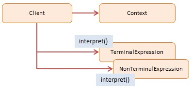

Interpreter
===========


## Definition

Given a language, define a representation for its grammar along with an interpreter that uses the representation to interpret sentences in the language.


## Summary

The Interpreter pattern offers a scripting language that allows end-users to customize their solution.

Some applications are so complex that they require advanced configuration. You could offer a basic scripting language which allows the end-user to manipulate your application through simple instructions. The Interpreter pattern solves this particular problem – that of creating a simple scripting language.

Certain types of problems lend themselves to be characterized by a language. This language describes the problem domain which should be well-understood and well-defined. To implement this you need to map the language to a grammar. Grammars are usually hierarchical tree-like structures that step through multiple levels and then end up with terminal nodes (also called literals).

Problems like this, expressed as a grammar, can be implemented using the Interpreter design pattern.

Today, if you really need this type of control in JavaScript it is probably easier to use a code generator like ANTLR which will allow you to build your own command interpreters based on a grammar that you provide.


## Diagram




## Participants

The objects participating in this pattern are:

- **Client** -- In sample code: the run() program.
    * builds (or is given) a syntax tree representing the grammar
    * establishes the initial context
    * invokes the interpret operations
- **Context** -- In sample code: _Context_
    * contains state information to the interpreter
- **TerminalExpression** -- In sample code: _Expression_
    * implements an interpret operation associated with terminal symbols in the grammar
    * one instance for each terminal expression in the sentence
- **NonTerminalExpression** -- In sample code: not used
    * implements an interpret operation associated for non-terminal symbols in the grammar


## Sample code in JavaScript

The objective of this example is to build an interpreter which translates roman numerals to decimal numbers: for example, XXXVI = 36.

The Context object maintains the input (the roman numeral) and the resulting output as it is being parsed and interpreted. The Expression object represents the nodes in the grammar tree; it supports the interpret method.

When running the program, a simple grammar tree is being built which then processes a roman numeral and translates it into a numeric.


```javascript
var Context = function(input){
    this.input = input;
    this.output = 0;
}

Context.prototype = {
    startsWith: function(str){
        return this.input.substr(0, str.length) === str;
    }
}

var Expression = function(name, one, four, five, nine, multiplier){
    this.name = name;
    this.one = one;
    this.four = four;
    this.five = five;
    this.nine = nine;
    this.multiplier = multiplier;
}

Expression.prototype = {
    interpret: function(context){
        if (context.input.length == 0){
            return;
        } else if (context.startsWith(this.nine)){
            context.output += (9 * this.multiplier);
            context.input = context.input.substr(2);
        } else if (context.startsWith(this.four)){
            context.output += (4 * this.multiplier);
            context.input = context.input.substr(2);
        } else if (context.startsWith(this.five)){
            context.output += (5 * this.multiplier);
            context.input = context.input.substr(1);
        }
        while (context.startsWith(this.one)){
            context.output += (1 * this.multiplier);
            context.input = context.input.substr(1);
        }
    }
}

function run(){
    var roman = "MCMXXVIII"
    var context = new Context(roman);
    var tree = [];

    tree.push(new Expression("thousand", "M", " ", " ", " ", 1000));
    tree.push(new Expression("hundred", "C", "CD", "D", "CM", 100));
    tree.push(new Expression("ten", "X", "XL", "L", "XC", 10));
    tree.push(new Expression("one", "I", "IV", "V", "IX", 1));

    for (var i = 0, len = tree.length; i < len; i++){
        tree[i].interpret(context);
    }

    alert(roman + " = " + context.output);
}
```

Source: [dofactory.com](http://www.dofactory.com/javascript/interpreter-design-pattern)