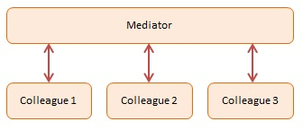

Mediator
========


## Definition

Define an object that encapsulates how a set of objects interact. Mediator promotes loose coupling by keeping objects from referring to each other explicitly, and it lets you vary their interaction independently.


## Summary

The Mediator pattern provides central authority over a group of objects by encapsulating how these objects interact. This model is useful for scenarios where there is a need to manage complex conditions in which every object is aware of any state change in any other object in the group.

The Mediator patterns are useful in the development of complex forms. Take for example a page in which you enter options to make a flight reservation. A simple Mediator rule would be: you must enter a valid departure date, a valid return date, the return date must be after the departure date, a valid departure airport, a valid arrival airport, a valid number of travelers, and only then the Search button can be activated.

Another example of Mediator is that of a control tower on an airport coordinating arrivals and departures of airplanes.


## Diagram




## Participants

The objects participating in this pattern are:

- **Mediator** -- In sample code: _Chatroom_
    * defines an interface for communicating with Colleague objects
    * maintains references to Colleague objects
    * manages central control over operations
- **Colleagues** -- In sample code: _Participants_
    * objects that are being mediated by the Mediator
    * each instance maintains a reference to the Mediator


## Sample code in JavaScript

In the example code we have four participants that are joining in a chat session by registering with a Chatroom (the Mediator). Each participant is represented by a Participant object. Participants send messages to each other and the Chatroom handles the routing.

This example is simple, but other complex rules could have been added, such as a 'junk filter' to protect participants from receiving junk messages.

The log function is a helper which collects and displays results.


```javascript
var Participant = function(name){
    this.name = name;
    this.chatroom = null;
};

Participant.prototype = {
    send: function(message, to){
        this.chatroom.send(message, this, to);
    },
    receive: function(message, from){
        log.add(from.name + " to " + this.name + ": " + message);
    }
};

var Chatroom = function(){
    var participants = {};

    return {
        register: function(participant){
            participants[participant.name] = participant;
            participant.chatroom = this;
        },

        send: function(message, from, to){
            if (to){
                // single message
                to.receive(message, from);
            } else {
                // broadcast message
                for (key in participants){
                    if (participants[key] !== from){
                        participants[key].receive(message, from);
                    }
                }
            }
        }
    };
};

// log helper
var log = (function(){
    var log = "";

    return {
        add: function(msg){
            log += msg + "\n";
        },
        show: function(){
            alert(log);
            log = "";
        }
    }
})();

function run(){
    var yoko = new Participant("Yoko");
    var john = new Participant("John");
    var paul = new Participant("Paul");
    var ringo = new Participant("Ringo");

    var chatroom = new Chatroom();
    chatroom.register(yoko);
    chatroom.register(john);
    chatroom.register(paul);
    chatroom.register(ringo);

    yoko.send("All you need is love.");
    yoko.send("I love you John.");
    john.send("Hey, no need to broadcast", yoko);
    paul.send("Ha, I heard that!");
    ringo.send("Paul, what do you think?", paul);

    log.show();
}
```

Source: [dofactory.com](http://www.dofactory.com/javascript/mediator-design-pattern)