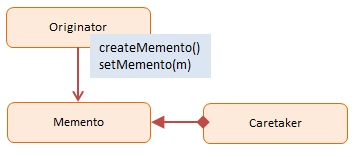

Memento
=======


## Definition

Without violating encapsulation, capture and externalize an object's internal state so that the object can be restored to this state later.


## Summary

The Memento pattern provides temporary storage as well as restoration of an object. The mechanism in which you store the object’s state depends on the required duration of persistence, which may vary.

You could view a database as an implementation of the Memento design pattern in which objects are persisted and restored. However, the most common reason for using this pattern is to capture a snapshot of an object’s state so that any subsequent changes can be undone easily if necessary.

Essentially, a Memento is a small repository that stores an object’s state. Scenarios in which you may want to restore an object into a state that existed previously include: saving and restoring the state of a player in a computer game or the implementation of an undo operation in a database.

In JavaScript Mementos are easily implemented by serializing and de-serializing objects with JSON.


## Diagram




## Participants

The objects participating in this pattern are:

- **Originator** -- In sample code: _Person_
    * implements interface to create and restore mementos of itself
        - in sample code: hydrate and dehydrate
    * the object which state is temporary being saved and restored
- **Memento** -- In sample code: _JSON representation of Person_
    * internal state of the Originator object in some storage format
- **CareTaker** -- In sample code: _CareTaker_
    * responsible for storing mementos
    * just a repository; does not make changes to mementos


## Sample code in JavaScript

The sample code creates two persons named Mike and John are created using the Person constructor function. Next, their mementos are created which are maintained by the CareTaker object.

We assign Mike and John bogus names before restoring them from their mementos. Following the restoration we confirm that the person objects are back to their original state with valid names.

The Memento pattern itself with CareTaker etc. is rarely used in JavaScript. However, JSON is a highly effective data format that is extremely useful in many different data exchange scenarios.


```javascript
var Person = function(name, street, city, state){
    this.name = name;
    this.street = street;
    this.city = city;
    this.state = state;
}

Person.prototype = {
    hydrate: function(){
        var memento = JSON.stringify(this);
        return memento;
    },

    dehydrate: function(memento){
        var m = JSON.parse(memento);
        this.name = m.name;
        this.street = m.street;
        this.city = m.city;
        this.state = m.state;
    }
}

var CareTaker = function(){
    this.mementos = {};

    this.add = function(key, memento){
            this.mementos[key] = memento;
        },

        this.get = function(key){
            return this.mementos[key];
        }
}

// log helper
var log = (function(){
    var log = "";

    return {
        add: function(msg){
            log += msg + "\n";
        },
        show: function(){
            alert(log);
            log = "";
        }
    }
})();


function run(){
    var mike = new Person("Mike Foley", "1112 Main", "Dallas", "TX");
    var john = new Person("John Wang", "48th Street", "San Jose", "CA");
    var caretaker = new CareTaker();

    // save state
    caretaker.add(1, mike.hydrate());
    caretaker.add(2, john.hydrate());

    // mess up their names
    mike.name = "King Kong";
    john.name = "Superman";

    // restore original state
    mike.dehydrate(caretaker.get(1));
    john.dehydrate(caretaker.get(2));

    log.add(mike.name);
    log.add(john.name);

    log.show();
}
```

Source: [dofactory.com](http://www.dofactory.com/javascript/memento-design-pattern)