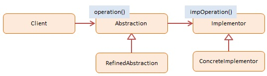

Bridge
======


## Definition

Decouple an abstraction from its implementation so that the two can vary independently.


## Summary

The Bridge pattern allows two components, a client and a service, to work together with each component having its own interface. Bridge is a high-level architectural pattern and its main goal is to write better code through two levels of abstraction. It facilitates very loose coupling of objects. It is sometimes referred to as a double Adapter pattern.

An example of the Bridge pattern is an application (the client) and a database driver (the service). The application writes to a well-defined database API, for example ODBC, but behind this API you will find that each driver's implementation is totally different for each database vendor (SQL Server, MySQL, Oracle, etc.).

The Bridge pattern is a great pattern for driver development but it is rarely seen in JavaScript.


## Diagram




## Participants

The objects participating in this pattern are:

- **Client** -- In sample code: the run() function.
    * calls into Abstraction to request an operation
- **Abstraction** -- not used in JavaScript
    * declares an interface for first level abstraction
    * maintains a reference to the Implementor
- **RefinedAbstraction** --  In sample code: _Gestures, Mouse_
    * implements and extends the interface defined by Abstraction
- **Implementor** -- not used in JavaScript
    * declares an interface for second level or implementor abstraction
- **ConcreteImplementor** -- In sample code: _Screen, Audio_
    * implements the Implementor interface and defines its effects


## Sample code in JavaScript

The objective of the example is to show that with the Bridge pattern input and output devices can vary independently (without changes to the code); the devices are loosely coupled by two levels of abstraction.

JavaScript does not support abstract classes therefore Abstraction and Implementor are not included. However, their interfaces (properties and methods) are consistently implemented in RefinedAbstraction and ConcreteImplementor. In our example code the Abstraction represents Input devices and the Implementor represents Output devices.

Gestures (finger movements) and the Mouse are very different input devices, but their actions map to a common set of output instructions: click, move, drag, etc. Screen and Audio are very different output devices, but they respond to the same set of instructions. Of course, the effects are totally different, that is, video updates vs. sound effects. The Bridge pattern allows any input device to work with any output device.

The log function is a helper which collects and displays results.

```javascript
// input devices
var Gestures = function(output){
    this.output = output;

    this.tap = function(){
        this.output.click();
    }
    this.swipe = function(){
        this.output.move();
    }
    this.pan = function(){
        this.output.drag();
    }
    this.pinch = function(){
        this.output.zoom();
    }
};

var Mouse = function(output){
    this.output = output;

    this.click = function(){
        this.output.click();
    }
    this.move = function(){
        this.output.move();
    }
    this.down = function(){
        this.output.drag();
    }
    this.wheel = function(){
        this.output.zoom();
    }
};

// output devices
var Screen = function(){
    this.click = function(){
        log.add("Screen select");
    }
    this.move = function(){
        log.add("Screen move");
    }
    this.drag = function(){
        log.add("Screen drag");
    }
    this.zoom = function(){
        log.add("Screen zoom in");
    }
};

var Audio = function() {
    this.click = function(){
        log.add("Sound oink");
    }
    this.move = function(){
        log.add("Sound waves");
    }
    this.drag = function(){
        log.add("Sound screetch");
    }
    this.zoom = function(){
        log.add("Sound volume up");
    }
};

// logging helper
var log = (function(){
    var log = "";

    return {
        add: function(msg){
            log += msg + "\n";
        },
        show: function(){
            alert(log);
            log = "";
        }
    }
})();

function run(){
    var screen = new Screen();
    var audio = new Audio();

    var hand = new Gestures(screen);
    var mouse = new Mouse(audio);

    hand.tap();
    hand.swipe();
    hand.pinch();

    mouse.click();
    mouse.move();
    mouse.wheel();

    log.show();
}
```

Source: [dofactory.com](http://www.dofactory.com/javascript/bridge-design-pattern)